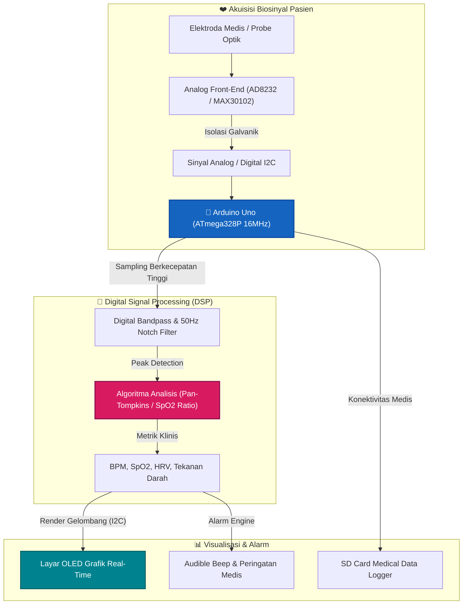

# ⚡ Arduino Uno Wearable Fall Detection Pendant with 6-Axis IMU & GSM

Elderly care fall detector calculating Acceleration Vector Magnitude (AVM) and sudden rotational velocity changes, triggering auto-canceling buzzer and GSM SMS alarm.

---

## 📊 Diagram Blok Arsitektur & Skema Alur Rangkaian

Visualisasi interaktif alur daya, akuisisi sinyal sensor, pemrosesan algoritma inti, dan aktuasi proteksi perangkat:

---

## 📦 Daftar Komponen & Bahan Lengkap (Bill of Materials - BOM)

Berikut rincian spesifikasi komponen fisik dan modul yang dibutuhkan untuk membangun proyek ini:

| No | Nama Komponen / Modul | Estimasi Jumlah | Fungsi & Spesifikasi Teknis |
|:---|:---|:---|:---|
| 1 | **Arduino Uno R3 (ATmega328P)** | 1 Unit | Mikrokontroler 8-bit deterministik 16MHz |
| 2 | **Adaptor Daya DC 9V-12V 1A / USB 5V** | 1 Unit | Sumber daya listrik stabil dengan proteksi arus |
| 3 | **Modul Biosensor Front-End Terisolasi (AD8232 / MAX30102 / ADS1292)** | 1 Unit | Akuisisi sinyal fisiologis berderau rendah |
| 4 | **Elektroda Medis Ag/AgCl / Probe Optik SpO2** | 1 Set | Antarmuka kontak biologis |
| 5 | **Modul Penyimpanan MicroSD SPI Card 16GB** | 1 Unit | Pencatatan data kontinu sinyal medis |
| 6 | **Layar OLED SSD1306 0.96 Inch I2C** | 1 Unit | Render grafik gelombang biosinyal real-time |
| 7 | **Buzzer Piezo & LED Indikator Rhythms** | 1 Set | Alarm batas ambang anomali detak jantung/tekanan |

---

## 🧠 Arsitektur Sistem & Fitur Utama

- **Deterministic Non-Blocking State Machine:** Memisahkan pemrosesan sinyal presisi tinggi dari task telemetri untuk mencegah *latency jitter*.
- **Digital Signal Processing (DSP) & Filtering:** Dilengkapi algoritma digital filtering terdedikasi untuk eliminasi derau sinyal analog.
- **Non-Volatile Storage (Internal EEPROM):** Parameter kalibrasi, *setpoint*, dan konfigurasi tersimpan secara persisten terhadap siklus pemadaman daya.
- **Hardware Failsafe & Emergency Interlock:** Perlindungan otomatis jika terjadi anomali tegangan, kelebihan beban arus, atau pemicuan tombol *Emergency Stop*.
- **Industrial Telemetry & Diagnostics:** Pelaporan status operasional secara real-time via Serial/JSON stream.

---

## 🔌 Skema Pinout & Koneksi Hardware

| Komponen / Sinyal | Pin (Arduino Uno) | Deskripsi Fungsi |
|:---|:---|:---|
| **Sensor Analog Input** | `Pin A0` | Jalur pembacaan sensor utama berpresisi tinggi |
| **Emergency Stop (E-Stop)** | `Pin 2 (INT0)` | Pemicu pengaman darurat hardware interrupt |
| **Actuator / Relay Utama** | `Pin 9 (PWM) / Pin 7` | Pengendali beban daya tinggi / relay aktuator |
| **Acoustic Alarm Buzzer** | `Pin 8` | Indikator peringatan audible saat terjadi anomali |
| **Status / Heartbeat LED** | `Pin 13` | Indikator status aktivitas sistem real-time |

---

## 🛠️ Panduan Perakitan Hardware (Langkah Demi Langkah)

1. **Persiapan Catu Daya:** Hubungkan catu daya utama ke jalur daya mikrokontroler. Pasang kapasitor *decoupling* 100nF di dekat pin VCC untuk meredam ripple switching.
2. **Pemasangan Sensor & Modul:** Sambungkan jalur sinyal sensor ke pin mikrokontroler yang telah ditentukan. Gunakan resistor pull-up 4.7kΩ pada jalur SDA/SCL jika menggunakan modul I2C.
3. **Pemasangan Aktuator:** Hubungkan modul relay / gate driver MOSFET ke pin kontrol output. Pasang dioda *flyback* (1N4007) pada beban induktif untuk mengeliminasi lonjakan tegangan balik (*back-EMF*).
4. **Pemasangan Tombol Emergency Stop:** Sambungkan tombol darurat ke pin interupsi eksternal dengan konfigurasi *Active-LOW* menggunakan resistor *pull-up*.
5. **Verifikasi Koneksi:** Lakukan pengecekan jalur ground bersama (*Common Ground*) pada seluruh modul sebelum menyalakan daya.

---

## 🚀 Panduan Kompilasi & Upload (Arduino IDE)

1. Buka **Arduino IDE 2.0+**.
2. Masuk ke menu **Tools > Board**:
   * Pilih **`Arduino Uno`**.
3. Pastikan dependensi pustaka terpasang via Library Manager:
   * `ArduinoJson`
   * `Wire` & `SPI`
   * `EEPROM`
4. Buka berkas [`arduino-uno-fall-detection-pendant.ino`](./arduino-uno-fall-detection-pendant.ino).
5. Klik tombol **Verify** (✓) kemudian **Upload** (➔).
6. Buka **Serial Monitor** pada baudrate **`115200`** untuk melihat streaming telemetri dan status operasional.

---

## 📄 Lisensi
Didistribusikan di bawah lisensi open-source **MIT License**. Dikembangkan oleh **Muhammad Fikri**.
